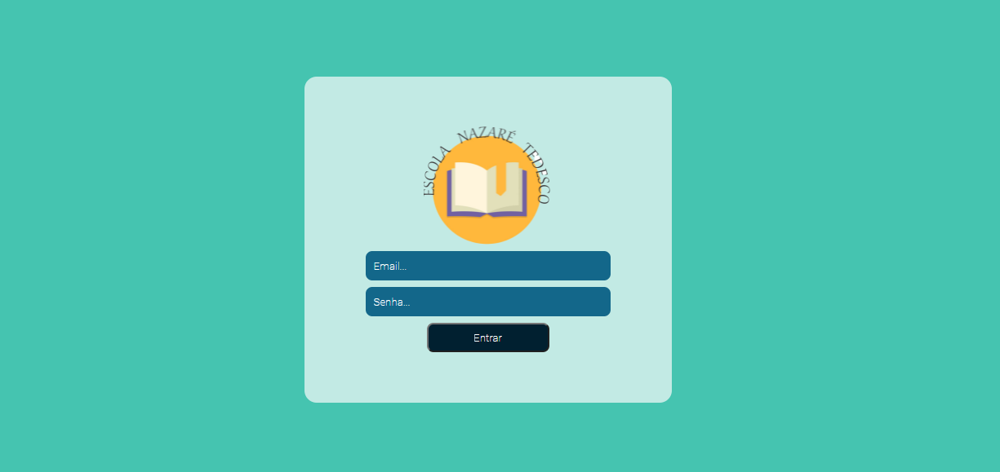
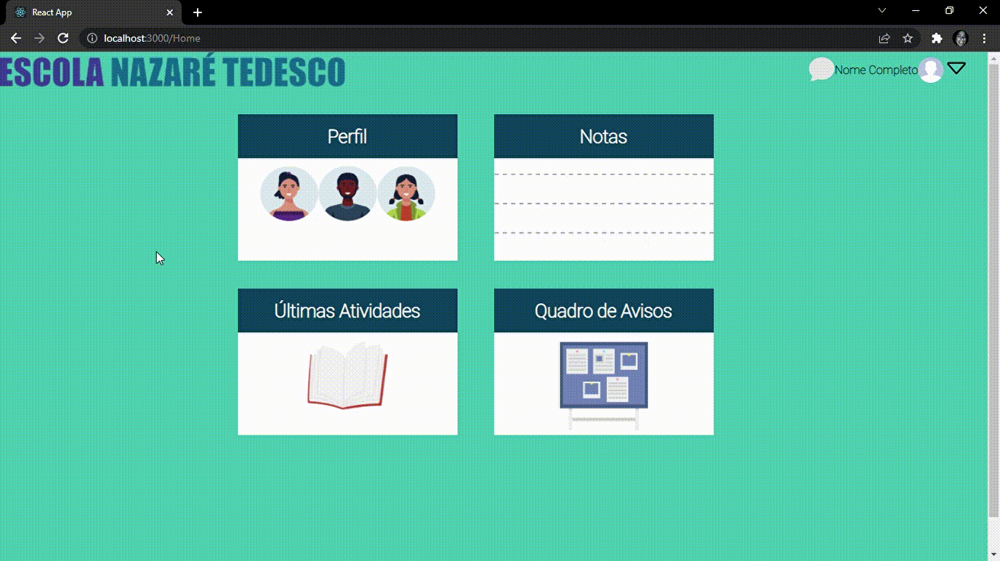
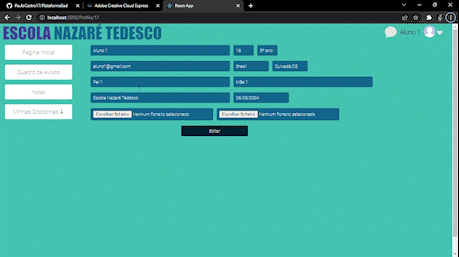

# Sobre o Projeto

O projeto é uma forma de estudo para mim, ele consiste em uma plataforma EAD.
Com o tempo vou colocando novas páginas e mostrando mudanças.

### Tecnologias Utilizadas
 * REACT.js

### Página de Login

### Página Home

  

### Página Profile

  

